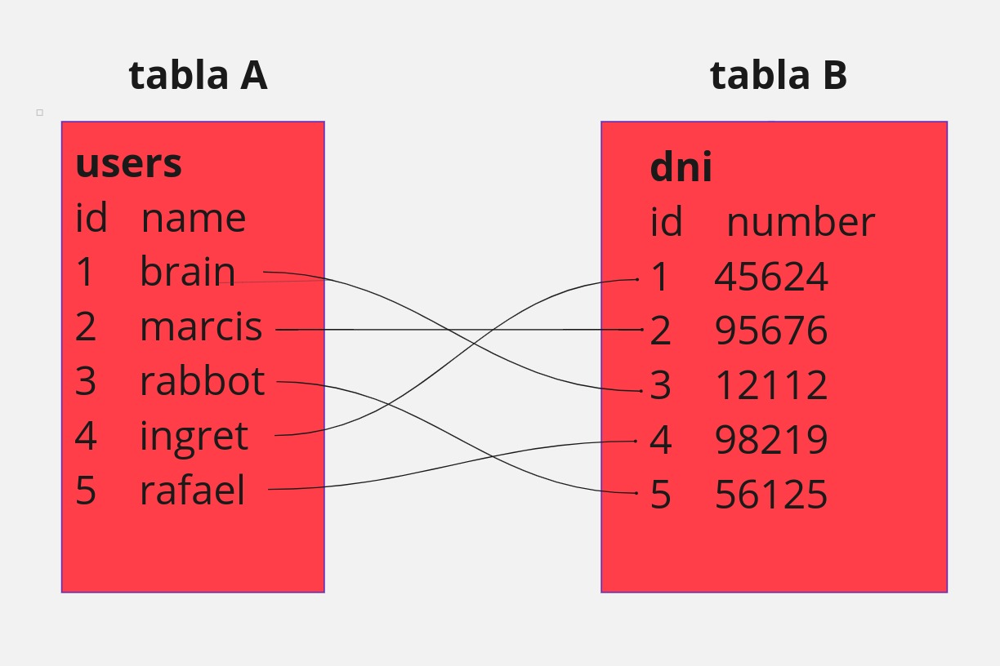
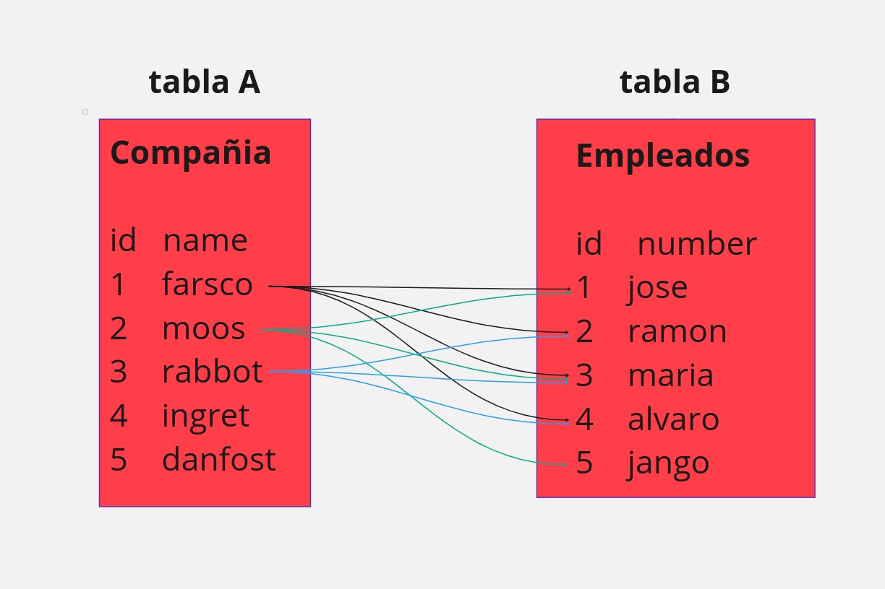
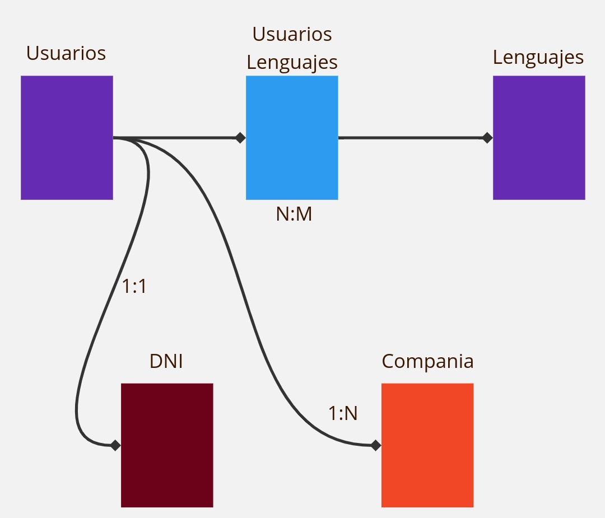

> https://www.w3schools.com/
- En el navegador se puede buscar mas informacion el cliente dependiendo al sistema operativo ejemplo mysql client windows
# mysql primeros pasos

> Para ubuntu
```bash
sudo apt update
sudo apt upgrade
sudo apt install mysql-server
sudo apt install mysql-client
mysql --version
sudo mysql_secure_installation
sudo systemctl status mysql
sudo mysql -u root

```
> Interfaces para trabajar en mysql
- dbvisualizer
- phpmyadmin
- devart
- sql pro studio
- table plus(nuevo)
- mysql workbench 

> Crear nuevo usuario 
```sql
CREATE USER 'nombre_de_usuario'@'localhost' IDENTIFIED BY 'contraseña';
GRANT ALL PRIVILEGES ON * . * TO 'nombre_de_usuario'@'localhost'; 
FLUSH PRIVILEGES;

```
# SELECT
```sql
-- sentencia para llamar toda la tabla users
SELECT * FROM users;

-- en vez de colocar un * para que muestre toda la tabla se coloca el nombre de la columna que se desea consultar
SELECT name FROM users;

-- si se quieren ver 2 o mas columnas
SELECT id_users , name FROM users;

-- SELECIONA LOS CAMPOS DISTINTOS
SELECT DISTINCT * FROM users;

-- vera cuales son distintos en la columna age
SELECT DISTINCT age FROM users;

-- selecciona la tabla y ordena los datos por medio del email
SELECT * FROM users ORDER BY email;

-- selecciona la tabla y ordena los datos por nedio del email de manera descentente
SELECT * FROM users ORDER BY email DESC;

-- aqui se selecciona la tabla y luego se hace la pregunta con where donde age = 15
-- el where es como un filtro
SELECT * FROM users WHERE age = 15;

-- esto toma la tabla busca donde email = 'sara' y ordenara de manera descendente
SELECT * FROM users WHERE email='sara@gmail.com' ORDER BY email DESC

-- esto toma la columna nombre se busca donde email = 'sara' y ordenara de manera ascendente
SELECT name FROM users WHERE email='sara@gmail.com' ORDER BY email ASC

-- seleciona la tabla users donde email buscara algo que contiene o se parece(LIKE) A gmail.com y se le coloca % para obviar lo que esta antes del gmail.com
SELECT * FROM users WHERE email LIKE '%gmail.com' 

-- seleciona la tabla users donde email buscara algo que contiene o se parece(LIKE) A gmail.com y se le coloca % para obviar lo que esta antes del gmail
SELECT * FROM users WHERE email LIKE '%gmail%'; 

-- selecciona la tabla users donde el negado de email contenga o se parezca a email ( osea que no contenga email )
SELECT * FROM users WHERE NOT email LIKE '%gmail%'; 

-- selecciona la tabla users donde el negado de email contenga o se parezca a email ( osea que no contenga email ) y que la edad sea 15
SELECT * FROM users WHERE NOT email LIKE '%gmail%' AND age = 15; 

-- selecciona la tabal users y limita a dos la consulta
SELECT * FROM users LIMIT 2;

-- selecciona la tabla users y donde email sea nulo mostrara registros
SELECT * FROM users WHERE email IS NULL;

-- selecciona la tabla users y donde email no sea nulo mostrara registros
SELECT * FROM users WHERE email IS  NOT NULL;

-- selecciona el valor maximo de la columna age de la tabla users
SELECT MAX(age) FROM users;

-- selecciona el valor minimo de la columna age de la tabla users
SELECT MAX(age) FROM users;

-- cuenta la cantidad de registro que contenga age( los nulos no los cuenta)
SELECT COUNT(age) FROM users;

-- cuenta la cantidad de registro que contenga la tabla
SELECT COUNT(*) FROM users;

--suma los valores de age 
SELECT SUM(age) FROM users;

-- avg de los valores de age
SELECT SUM(age) FROM users;

-- selecciona la tabla users y donde el filtro IN vea en la columna name a juan o hector devolvera los registros que coincidan incluso asi esten en mayuscula
SELECT * FROM users WHERE name IN ('juan','hector');

-- selecciona la tabla users y donde edad este entre 18 y 30 mostrar registros
SELECT * FROM users WHERE age BETWEEN 18 AND 30;

--- ALIAS ( AS )
--en este caso cambiara el nombre de init_date por fecha de programacion 
SELECT init_date AS 'fecha de nacimiento' FROM users WHERE age BETWEEN 18
 AND 30;

-- CONCATENAR ( CONCAT )
-- tomara las columnas name luego le agrega un espacio y luego la columna surname y las concatena en una sola columna
SELECT CONCAT(name,' ',surname) FROM users;
-- aqui tomara un cooncatena un conjunto de texto con datos 
SELECT CONCAT('el nombre es:',name,' ','y el apellido es: ',surname) FROM users;

-- aqui se le coloca un alias al codigo de la concatenacion
SELECT CONCAT('el nombre es:',name,' ','y el apellido es: ',surname) AS 'Nombre completo' FROM users;

-- AGRUPACIONES (GROUP BY)
-- esto agrupara todo los maximos que eisten en age
SELECT MAX(age) FROM users GROUP BY age;
-- esto agrupara el conteo de las edades
SELECT COUNT(age) FROM users GROUP BY age;

-- aqui se usan varios comamdos y se explica de la siguiente manera se selecciona la columna edad de la tabla users
-- y donde edad sea mayor a 20 agrupe las edades y las ordenes de manera ascendente.
SELECT age FROM users WHERE age > 20 GROUP BY age ORDER BY age ASC;

-- HAVING ( agregar funcionalidades )
-- Esto me devolvera los usuarios con edades menores a 30;
SELECT * FROM users HAVING age < 30;
-- esto me devolvera el conteo mayor a 5
SELECT COUNT(age) FROM users HAVING COUNT(age) > 5;

-- CASE( realiza una logica completa )
-- aqui se selecciona toda la tabla y se realiza un case el cual se compara si las edades son mayor a 20
-- si esto se cumple mostrar un mensaje de lo contrario mostrara otro mensaje y esto se coloca en un alias 
-- llamado comparador 
SELECT *,
    CASE
    WHEN age > 20 THEN 'SI PUEDE INGRESAR'
    ELSE 'NO PUEDE INGRESAR'
    END AS 'COMPARADOR'
    FROM users;


-- en este caso se selecciona la columna age pero si esta tiene un valor nulo lo reemplazara por un 0
SELECT IFNULL(age,0) FROM users;

-- este caso es = al contrario solo que devolvera el nombre y apellido 
SELECT name,surname, IFNULL(age,0) FROM users;

```
# ESCRITURA DE DATOS

```sql
-- INSERT INTO ( insertar dentro )
-- se inserta dentro de usuarios en las columnas nombre,apellido, edad los valores 'daniel','morillo',34 
INSERT INTO users(name,surname,age) VALUES ('daniel','morillo',34);

```

# MODIFICACION DE DATOS

```sql
-- modifica en la tabla usuarios el valor de las columna edad a 27 ( ojo esto solo se hace si quieres cambiar todas las edades al mismo valor)
UPDATE users SET age = 27;

-- modifica en la tabla usuarios la edad a 27 donde id del usuario sea la 2
UPDATE users SET age = 27 WHERE id_users = 2;

-- modifica en la tabla usuarios la edad a 54 y la fecha a 1972-01-13 donde id del usuario sea 16
UPDATE users SET age = 54,init_date = '1972-01-13' WHERE id_users = 16;

```
# ELIMINAR DATOS

```sql

-- eliminar de la tabla users el id donde id_users = 18
DELETE FROM users WHERE id_users = 18;

```
# BASE DE DATOS

```sql

-- se crea una base de datos llamada test
CREATE DATABASE test;

-- se eleimina una base de datos llamada test
DROP DATABASE test;

```

# ADMINISTRAR TABLAS

```sql

-- crear una tabla llamada persons el cual tendra como atributo id de tipo entero, una name de tipo varchar de (50) caracteres , un age de tipo int un email de 100 caracteres y un created de tipo date
CREATE TABLE persons (
    id int,
    name varchar(50),
    age int,
    email varchar(100),
    created date
    );

-- crear tabla llamada persons_dos pero a difencia de la primera tabla a esta se le agrega el NOT NULL a la id y al nombre queriendo decir que estas 2 columnas no podran ingresar valores nulos
CREATE TABLE persons_dos (
    id int NOT NULL,
    name varchar(100) NOT NULL,
    age int,
    email varchar(50),
    created date
    );


-- en esta tabla creada la diferencia es que se usa el UNIQUE el cual nos dice que sera unico , no que podra repetir en este tabla el valor de la id.
CREATE TABLE persons_three (
    id int NOT NULL,
    name varchar(100) NOT NULL,
    age int,
    email varchar(50),
    created datetime,
    UNIQUE(id)
    );


-- en esta tabla se usa el primary key como identificador unico y primordial de la tabla, osea la clave primaria
CREATE TABLE persons_for (
    id int NOT NULL,
    name varchar(100) NOT NULL,
    age int,
    email varchar(50),
    created datetime,
    UNIQUE(id),
    PRIMARY KEY(id)
);


-- aqui se agrega un restriccion llamada CHECK el cual se le agrega una logica y si la cumple dejar acargar valores a la tabla de lo contrario no lo hara
CREATE TABLE persons_five ( 
    id int NOT NULL, 
    name varchar(100) NOT NULL,
    age int, 
    email varchar(50) NOT NULL, 
    created datetime, 
    UNIQUE(id), 
    PRIMARY KEY(id), 
    CHECK( age>18 ) );


-- aqui se le agrega a la columna created un valor por defecto( DEFAULT )
CREATE TABLE persons_six ( 
    id int NOT NULL, 
    name varchar(100) NOT NULL,
    age int, 
    email varchar(50) NOT NULL, 
    created datetime DEFAULT CURRENT_TIMESTAMP(), 
    UNIQUE(id), 
    PRIMARY KEY(id), 
    CHECK( age>18 ) );


CREATE TABLE persons_six ( 
    id int NOT NULL AUTO_INCREMENT = 100, 
    name varchar(100) NOT NULL,
    age int, 
    email varchar(50) NOT NULL, 
    created datetime DEFAULT CURRENT_TIMESTAMP(), 
    UNIQUE(id), 
    PRIMARY KEY(id) ) 

```

# ELIMINAR UNA TABLA

```sql

-- eliminar la tabla con el nombre persons
DROP TABLE persons;

```
# MODIFICAR TABLAS

```sql
-- agregar nueva columna (ADD)
ALTER TABLE persons_seven ADD surname varchar(150) NOT NULL;

-- renombrar columna(RENAME COLUMN)
ALTER TABLE persons_seven RENAME COLUMN surname TO descripcion;

-- modificar tipo de dato (MODIFY COLUMN)
ALTER TABLE persons_seven MODIFY COLUMN descripcion VARCHAR(200);

-- alterar la tabla dni y modificar la columna dni_id colocando el tipo de dato entero luego que sea autoincremental y luego se le asigna un 2 al autoincremento para que lo haga de dos en dos;
ALTER TABLE dni MODIFY COLUMN dni_id INT AUTO_INCREMENT, AUTO_INCREMENT=2;

-- eliminar columnas (DROP COLUMN)
ALTER TABLE persons_seven DROP COLUMN descripcion;


```
# RELACIONES ENTRE TABLAS
### RELACION 1:1



```sql
-- LA COLUMNA QUE LLEVE EL AUTO_INCREMENT DBE SER LA LLAVE PRIMARIA (PRIMARY KEY)
CREATE TABLE users (
    id_users int NOT NULL AUTO_INCREMENT PRIMARY KEY,
    name VARCHAR(100) NOT NULL,
    surname VARCHAR(100) NOT NULL,
    age int NOT NULL,
    email VARCHAR(100) NOT NULL,
);

CREATE TABLE dni (
    dni_id int NOT NULL AUTO_INCREMENT PRIMARY KEY,
    dni_number int NOT NULL,
    id_users int,
    UNIQUE(dni_id),
    UNIQUE(id_users),
    FOREIGN KEY(id_users) REFERENCES users(id_users)
);

```
### RELACION 1:N



```sql
-- LA COLUMNA QUE LLEVE EL AUTO_INCREMENT DBE SER LA LLAVE PRIMARIA (PRIMARY KEY)
CREATE TABLE users (
    id_users int NOT NULL AUTO_INCREMENT PRIMARY KEY,
    name VARCHAR(100) NOT NULL,
    surname VARCHAR(100) NOT NULL,
    age int NOT NULL,
    email VARCHAR(100) NOT NULL,
);

ALTER TABLE users 
ADD id_company varchar(100);

CREATE TABLE company (
    company_id int NOT NULL AUTO_INCREMENT PRIMARY KEY,
    name varchar(100) NOT NULL
    );

ALTER TABLE users 
ADD CONSTRAINT fk_company
FOREIGN KEY(id_company) REFERENCES company(company_id);

```
### RELACION N:N

```sql
CREATE TABLE languajes(
    languajes_id int AUTO_INCREMENT PRIMARY KEY,
    name varchar(100)
);

-- a las tablas intermedias de la relacion muchos a muchos el nombre por lo general es el nombre
-- de las 2 tablas

CREATE TABLE users_languajes(
    users_languajes_id int AUTO_INCREMENT PRIMARY KEY,
    users_id int NOT NULL,
    languajes_id int NOT NULL,
    FOREIGN KEY(users_id) REFERENCES users(id_users),
    FOREIGN key(languajes_id) REFERENCES languajes(languajes_id),
    UNIQUE (users_id,languajes_id)
);


```
Las tablas quedaria relacionadas asi



### CONSULTAS DE RELACIONES

```sql
-- INNER JOIN( CONSULTAR DATOS COMUNES DE 2 O MAS TABLAS  )
-- aqui se selecciona todo sobre la tabla users y se aplica la union con la tabla dni y que devuelva 
-- la igualdad entre la columna id_users de la tabla users y la columna dni_id de la tabla dni.
SELECT * FROM users
INNER JOIN dni
ON users.id_users = dni.dni_id;

-- realiza lo mismo solo que se le coloca en filtrar por orden ascendente
SELECT * FROM users
INNER JOIN dni
ON users.id_users = dni.dni_id
ORDER BY age ASC;

-- APLICACION DE INNER JOIN EN RELACIONES 1:N

SELECT * FROM users
INNER JOIN company
ON users.id_company = company.company_id;

-- APLICACION DE INNER JOIN EN RELACION N:N
--  aqui se realiza el join pero en relaciona 3 tablas
SELECT * 
FROM users_languajes
INNER JOIN users ON users_languajes.users_id = users.id_users
INNER JOIN languajes ON users_languajes.users_id = languajes.languajes_id;

-- aqui devolvera del join solo los nombres de los usuarios y los lenguajes
SELECT users.name,languajes.name
FROM users_languajes
INNER JOIN users ON users_languajes.users_id = users.id_users
INNER JOIN languajes ON users_languajes.users_id = languajes.languajes_id;

--LEFT JOIN
-- Este devolvera las columnas de la tabla izquierda
-- Siempre se queda con los datos de la izquierda y si no posee le colocara un NULL
SELECT * FROM users
LEFT JOIN dni
ON users.id_users = dni.dni_id;

SELECT name,dni_number FROM users
LEFT JOIN dni
ON users.id_users = dni.dni_id;

SELECT dni_number,name FROM users
LEFT JOIN dni
ON users.id_users = dni.dni_id;

SELECT users.name,languajes.name
FROM users_languajes
LEFT JOIN users ON users_languajes.users_id = users.id_users
LEFT JOIN languajes ON users_languajes.users_id = languajes.languajes_id;

SELECT languajes.name,users.name
FROM users_languajes
LEFT JOIN users ON users_languajes.users_id = users.id_users
LEFT JOIN languajes ON users_languajes.users_id = languajes.languajes_id;

-- RIGH JOIN
-- Este devolvera las columnas de la tabla derecha
-- Siempre se queda con los datos de la derecha y si no posee le colocara un NULL
SELECT * FROM users
RIGHT JOIN dni
ON users.id_users = dni.dni_id;

SELECT name,dni_number FROM users
RIGHT JOIN dni
ON users.id_users = dni.dni_id;

SELECT languajes.name,users.name
FROM users_languajes
RIGHT JOIN users ON users_languajes.users_id = users.id_users
RIGHT JOIN languajes ON users_languajes.users_id = languajes.languajes_id;

-- FULL JOIN
-- esto une las dos tablas que se relacionen y devuelve todos sus datos
-- NOTA: en mysql no existe el full join
SELECT * users
FULL JOIN dni
ON users.id_users = dni.dni_id;

-- UNION 
-- para que esto funcione deben coincidir el nombre de las columnas en las tablas
SELECT name FROM users 
UNION 
SELECT name FROM company;

SELECT name FROM users WHERE name = 'hector' UNION SELECT name FROM company WHERE name = 'INVENCEM';
```
# CONCEPTOS AVANZADOS
```sql
-- INDEX
-- Al crear indice genera que la tabla pese  mas
-- En una tabla que tenga indice cada vez que se ingrese datos se hara mas lento ya que tien que regenerar el indice
-- Los indice son buenos para la lectura de datos
-- el indice se agrega en el campo donde sea mas facil la busqueda

-- aqui se crea un indice llamado idx_name en la tabla users campo name
CREATE INDEX idx_name ON users(name);

-- crear indice siendo unico
CREATE UNIQUE INDEX idx_name ON users(name);

-- crear indice con dos campos de lectura
CREATE UNIQUE INDEX idx_name ON users(name,surname);

-- al realizar consultas como esta gracia sal indice se realizaran de manera mas rapida
SELECT * FROM users WHERE name = 'hector';

-- Eliminar indice 
DROP INDEX idx_name ON users;

-- TRIGGER

-- Aqui se crea un disparador llamado tg_email donde se disparara despues de una modificacion en la tabla users si el email antiguo es diferente al email nuevo e insertara el email antiguo en la tabla email_history
DELIMITER $$
CREATE TRIGGER tg_email
AFTER UPDATE ON users
FOR EACH ROW
BEGIN
    IF OLD.email <> NEW.email THEN
        INSERT INTO email_history(users_id, email)
        VALUES(OLD.id_users, OLD.email);
    END IF;
END $$

DELIMITER;
-- eliminar trigger
DROP TRIGGER tg_email

--VIEW
-- las vistas nos ayudan a guardar consultas que son repetitivas el cual nos mostrara virtualmente una tabla
-- las vistas tienen el mismo problema que los indices, el cual cuando la tabla donde es generada la vista es modificada la vsita se regenera
CREATE VIEW v_users_ages AS
SELECT name,age
FROM users
WHERE age > 18;
-- manera de llamar a la vista
SELECT * FROM v_users_ages;
-- eliminar vista 
DROP VIEW v_users_ages;

-- STORED PROCEDURE( PROCEDIMIENTO ALMACENADO )

DELIMITER //
CREATE PROCEDURE p_all_users()
BEGIN
    SELECT * FROM users;
END//

-- ejecutar procedimiento
CALL p_all_users();

-- con parametros
DELIMITER //
CREATE PROCEDURE p_all_user(IN age_param int)
BEGIN
    SELECT * FROM users WHERE age = age_param;
END//


-- eliminar procedimientos
DROP PROCEDURE p_all_users;
```

# CONEXION DESDE CODIGO
- https://github.com/mouredev/retos-programacion-2023/tree/main/Retos/Reto%20%2323%20-%20LA%20BASE%20DE%20DATOS%20%5BMedia%5D
CONECTORES CON PYTHON
ANTES DE ESO ASEGURAR TENER INSTALADO LA LIBRERIA SQL CONNECTION
- sudo apt install python3-pip
- pip install mysql-connector-python
```python
import mysql.connector


config = {
    "host":"127.0.0.1",
    "port":"3306",
    "database":"hola_mysql",
    "user":"mantenimiento",
    "password":"20989862"
}

connection = mysql.connector.connect(**config)
cursor = connection.cursor()

query = "SELECT * FROM users"
cursor.execute(query)
result = cursor.fetchall()

for row in result:
    print(row)

cursor.close()
connection.close()

# CON INYECCION SQL
import mysql.connector

def base_date(user):
    config = {
        "host":"127.0.0.1",
        "port":"3306",
        "database":"hola_mysql",
        "user":"mantenimiento",
        "password":"20989862"
    }

    connection = mysql.connector.connect(**config)
    cursor = connection.cursor()

    query = "SELECT * FROM users WHERE name ='" + user + "';"
    cursor.execute(query)
    result = cursor.fetchall()

    for row in result:
        print(row)

    cursor.close()
    connection.close()

base_date("juan")

# DE MANERA MAS SEGURA PARA EVITAR LAS INYECCIONES SQL

import mysql.connector

def base_date(user):
    config = {
        "host":"127.0.0.1",
        "port":"3306",
        "database":"hola_mysql",
        "user":"mantenimiento",
        "password":"20989862"
    }

    connection = mysql.connector.connect(**config)
    cursor = connection.cursor()

    query = "SELECT * FROM users WHERE name = %s;"
    cursor.execute(query,(user,))
    result = cursor.fetchall()

    for row in result:
        print(row)

    cursor.close()
    connection.close()

base_date("hector")

```
# SUBIR LA BASE DE DATOS A LA NUBE

- https://vercel.com( para postgres )
- https://supabase.com( para postgres )
- https://raiolanetworks.com( hosting )
- https://planetscale.com ( para mysql )
- https://www.clever-cloud.com ( gratuita para cualquier getsor de base de datos )

# CLIENTES DE BASES DE DATOS

- https://www.dbvis.com/
- https://tableplus.com/
- https://www.devart.com/

# PARA EXPORTAR LA BASE DE DATOS
### DE MANERA LOCAL

mysqldump -u TU_USUARIO -p NOMBRE_DE_LA_BASE_DE_DATOS > archivo.sql

NOTA: Al importar una base de datos a la nube tal vez esta necesite que cambies el usuario y el nombre de la base de datos tal cual es generado en la nube y no se pueda cambiar.

## Proximo a aprender( Diseño de bases de datos ), concurrencia, seguridad.
